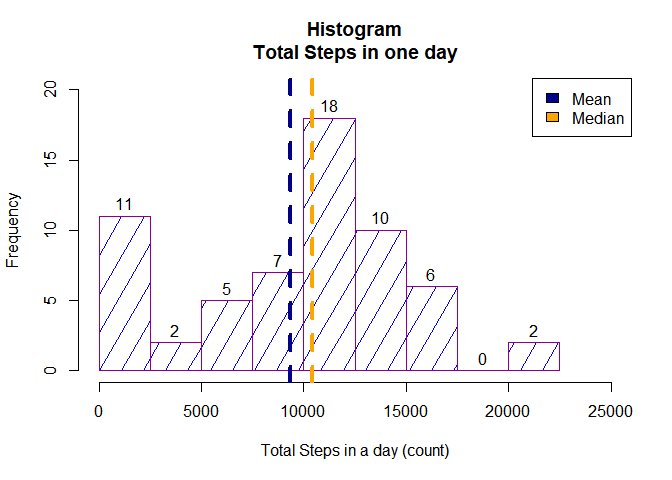
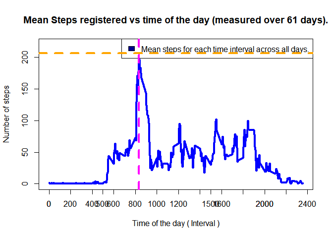
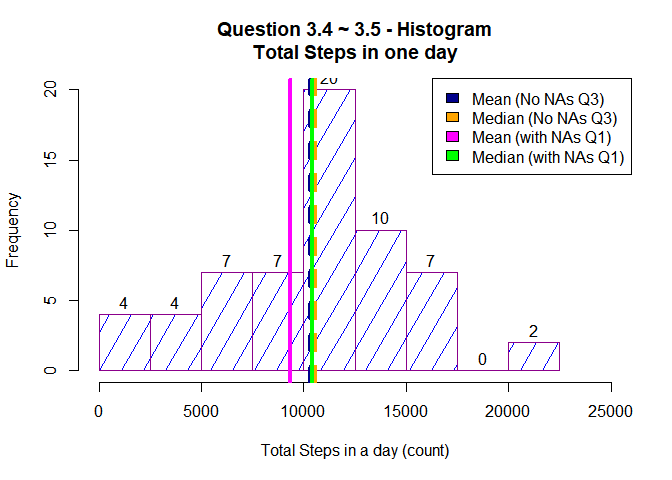
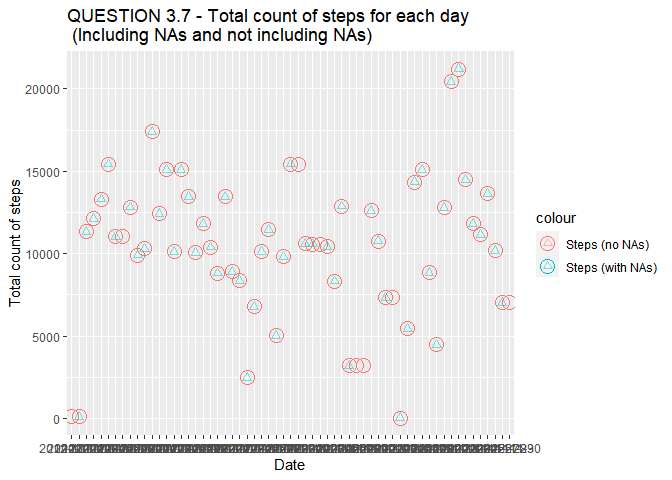
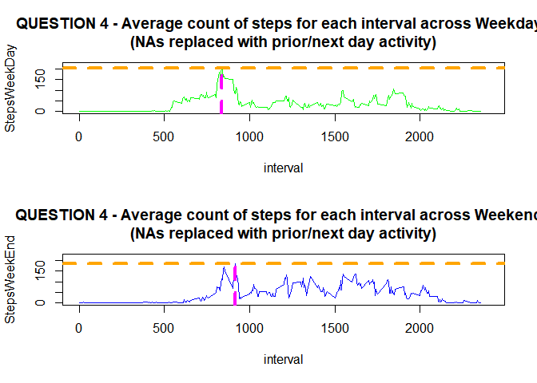

This assignment will be described in multiple parts. You will need to write a report that answers the questions detailed below. Ultimately, you will need to complete the entire assignment in a single R markdown document that can be processed by knitr and be transformed into an HTML file.

Throughout your report make sure you always include the code that you used to generate the output you present. When writing code chunks in the R markdown document, always use echo = TRUE\color{red}{\verb|echo = TRUE|}echo = TRUE so that someone else will be able to read the code. This assignment will be evaluated via peer assessment so it is essential that your peer evaluators be able to review the code for your analysis.

For the plotting aspects of this assignment, feel free to use any plotting system in R (i.e., base, lattice, ggplot2)

Fork/clone the GitHub repository created for this assignment. You will submit this assignment by pushing your completed files into your forked repository on GitHub. The assignment submission will consist of the URL to your GitHub repository and the SHA-1 commit ID for your repository state.

NOTE: The GitHub repository also contains the dataset for the assignment so you do not have to download the data separately.
Loading and preprocessing the data


```{ r, results = "hide", message = FALSE }
library( datasets )
library( dplyr )
```
Load data:

```r
dataset <- read.csv( "activity.csv" )
str( dataset )
```

```
## 'data.frame':	17568 obs. of  3 variables:
##  $ steps   : int  NA NA NA NA NA NA NA NA NA NA ...
##  $ date    : chr  "2012-10-01" "2012-10-01" "2012-10-01" "2012-10-01" ...
##  $ interval: int  0 5 10 15 20 25 30 35 40 45 ...
```

```r
cat("\n")
```

```r
dim( dataset )
```

```
## [1] 17568     3
```

```r
cat("\n")
```

```r
summary( dataset )
```

```
##      steps            date              interval     
##  Min.   :  0.00   Length:17568       Min.   :   0.0  
##  1st Qu.:  0.00   Class :character   1st Qu.: 588.8  
##  Median :  0.00   Mode  :character   Median :1177.5  
##  Mean   : 37.38                      Mean   :1177.5  
##  3rd Qu.: 12.00                      3rd Qu.:1766.2  
##  Max.   :806.00                      Max.   :2355.0  
##  NA's   :2304
```

```r
cat("\n")
```
Question 1
==========
What is mean total number of steps taken per day?
For this part of the assignment, you can ignore the missing values in the dataset.

Calculate the total number of steps taken per day.
If you do not understand the difference between a histogram and a barplot, research the difference between them. Make a histogram of the total number of steps taken each day.
Calculate and report the mean and median of the total number of steps taken per day


```r
library( dplyr )
```

```
## 
## Attaching package: 'dplyr'
```

```
## The following objects are masked from 'package:stats':
## 
##     filter, lag
```

```
## The following objects are masked from 'package:base':
## 
##     intersect, setdiff, setequal, union
```

```r
DayStepsDF <- dataset %>% group_by( date ) %>% summarize( DaySteps = sum( steps , na.rm = TRUE ) )
str( DayStepsDF )
```

```
## tibble [61 x 2] (S3: tbl_df/tbl/data.frame)
##  $ date    : chr [1:61] "2012-10-01" "2012-10-02" "2012-10-03" "2012-10-04" ...
##  $ DaySteps: int [1:61] 0 126 11352 12116 13294 15420 11015 0 12811 9900 ...
```

```r
cat("\n")
```

```r
dim( DayStepsDF )
```

```
## [1] 61  2
```

```r
cat("\n")
```

```r
summary( DayStepsDF )
```

```
##      date              DaySteps    
##  Length:61          Min.   :    0  
##  Class :character   1st Qu.: 6778  
##  Mode  :character   Median :10395  
##                     Mean   : 9354  
##                     3rd Qu.:12811  
##                     Max.   :21194
```

```r
cat("\n")
```

```r
#png( "graphQ1.png", width = 700, height = 700, unit = #"px" )
mygraph <-  hist( DayStepsDF$DaySteps, 
                    xlab = "Total Steps in a day (count)", 
                    ylab = "Frequency", 
                    main = "Histogram\nTotal Steps in one day", 
                    ylim = c(0, 20), 
                    xlim = c(0, 25000), 
                    col = "blue", 
                    density = 5,
                    angle = 60,
                    breaks = c(0, 2500, 5000, 7500, 10000, 12500, 15000, 17500, 20000, 22500),
                    border = "darkmagenta",
                    labels = TRUE )
            abline( v = mean( DayStepsDF$DaySteps), col = "darkblue", lty = 2, lwd = 4  )
            abline( v = median( DayStepsDF$DaySteps), col = "orange", lty = 2, lwd = 4  )
            legend("topright", c("Mean", "Median"), fill = c( "darkblue", "orange" ) )
```

<!-- -->

```r
#print( mygraph )

#dev.off()
```
Question 2
==========
What is the average daily activity pattern?

Make a time series plot (i.e. type = "l"\color{red}{\verb|type = "l"|}type = "l") of the 5-minute interval (x-axis) and the average number of steps taken, averaged across all days (y-axis)

Which 5-minute interval, on average across all the days in the dataset, contains the maximum number of steps?


```r
IntervalDF <- dataset %>% group_by( interval ) %>% summarize( DaySteps = mean( steps , na.rm = TRUE ) )
cat("\n")
```

```r
#IntervalDF$interval
#cat("\n")
str( IntervalDF )
```

```
## tibble [288 x 2] (S3: tbl_df/tbl/data.frame)
##  $ interval: int [1:288] 0 5 10 15 20 25 30 35 40 45 ...
##  $ DaySteps: num [1:288] 1.717 0.3396 0.1321 0.1509 0.0755 ...
```

```r
cat("\n")
```

```r
dim( IntervalDF )
```

```
## [1] 288   2
```

```r
cat("\n")
```

```r
summary( IntervalDF )
```

```
##     interval         DaySteps      
##  Min.   :   0.0   Min.   :  0.000  
##  1st Qu.: 588.8   1st Qu.:  2.486  
##  Median :1177.5   Median : 34.113  
##  Mean   :1177.5   Mean   : 37.383  
##  3rd Qu.:1766.2   3rd Qu.: 52.835  
##  Max.   :2355.0   Max.   :206.170
```

```r
cat("\n")
```

```r
head( IntervalDF )
```

```
## # A tibble: 6 x 2
##   interval DaySteps
##      <int>    <dbl>
## 1        0   1.72  
## 2        5   0.340 
## 3       10   0.132 
## 4       15   0.151 
## 5       20   0.0755
## 6       25   2.09
```

```r
cat("\n")
```

```r
tail( IntervalDF )
```

```
## # A tibble: 6 x 2
##   interval DaySteps
##      <int>    <dbl>
## 1     2330    2.60 
## 2     2335    4.70 
## 3     2340    3.30 
## 4     2345    0.642
## 5     2350    0.226
## 6     2355    1.08
```

```r
cat("\n")
```

```r
#png( "graphQ2.png", width = 700, height = 700, unit = "px" )
mygraph <-  with( IntervalDF, 
                    plot( x = interval, y = DaySteps, type = "l" ,
                        xlab = "Time of the day ( Interval )",
                        ylab = "Number of steps", 
                        main = "Mean Steps registered vs time of the day (measured over 61 days).", 
                        ylim = c(0, 220), 
                        #xlim = c(0, 25000),
                        col = "blue",
                        lwd = 4 )
                    )
            legend("topright", c("Mean steps for each time interval across all days."), fill = c( "darkblue" ) )
            axis(1, at = seq( 0, 2400, 200 ) )
print( mygraph )
```

```
## NULL
```

```r
maxSteps <- max( IntervalDF$DaySteps )
maxSteps # 206 steps is the highest average steps registered over 61 days at time interval.....
```

```
## [1] 206.1698
```

```r
cat("\n")
```

```r
maxInterval <- IntervalDF[ IntervalDF$DaySteps == maxSteps, 1]
maxInterval # .....8.35 am 
```

```
## # A tibble: 1 x 1
##   interval
##      <int>
## 1      835
```

```r
cat("\n")
```

```r
abline( v = maxInterval, col = "magenta", lty = 2, lwd = 4  )
abline( h = maxSteps, col = "orange", lty = 2, lwd = 4  )
```

<!-- -->

```r
#dev.off()
```
 Question 3:
============
Imputing missing values
Note that there are a number of days/intervals where there are missing values.
The presence of missing days may introduce bias into some calculations or summaries of the data.

3.1 Calculate and report the total number of missing values in the dataset.


```r
datasetNA <- which( is.na( dataset$steps ) )# 2304 rows are "NA" $steps+
str( datasetNA )
```

```
##  int [1:2304] 1 2 3 4 5 6 7 8 9 10 ...
```

```r
cat("\n")
```

```r
mean( is.na( dataset$steps ) ) * 100 # 13% of steps data is missing.
```

```
## [1] 13.11475
```

```r
cat("\n")
```

3.2 Devise a strategy for filling in all of the missing values in the dataset. 
The strategy does not need to be sophisticated. For example, you could 	use the mean/median for that day, 
or the mean for that 5-minute interval, etc.

Explore the NA values.
Total number of steps per day:
Total number of intervals wich register a value, including zero ( no NA )


```r
DayMeanStepsValues <- dataset %>% group_by( date ) %>% summarize( NotNAs = sum( !is.na( steps ) ) )
DayMeanStepsValues <- as.data.frame( DayMeanStepsValues )
DayMeanStepsValues 
```

```
##          date NotNAs
## 1  2012-10-01      0
## 2  2012-10-02    288
## 3  2012-10-03    288
## 4  2012-10-04    288
## 5  2012-10-05    288
## 6  2012-10-06    288
## 7  2012-10-07    288
## 8  2012-10-08      0
## 9  2012-10-09    288
## 10 2012-10-10    288
## 11 2012-10-11    288
## 12 2012-10-12    288
## 13 2012-10-13    288
## 14 2012-10-14    288
## 15 2012-10-15    288
## 16 2012-10-16    288
## 17 2012-10-17    288
## 18 2012-10-18    288
## 19 2012-10-19    288
## 20 2012-10-20    288
## 21 2012-10-21    288
## 22 2012-10-22    288
## 23 2012-10-23    288
## 24 2012-10-24    288
## 25 2012-10-25    288
## 26 2012-10-26    288
## 27 2012-10-27    288
## 28 2012-10-28    288
## 29 2012-10-29    288
## 30 2012-10-30    288
## 31 2012-10-31    288
## 32 2012-11-01      0
## 33 2012-11-02    288
## 34 2012-11-03    288
## 35 2012-11-04      0
## 36 2012-11-05    288
## 37 2012-11-06    288
## 38 2012-11-07    288
## 39 2012-11-08    288
## 40 2012-11-09      0
## 41 2012-11-10      0
## 42 2012-11-11    288
## 43 2012-11-12    288
## 44 2012-11-13    288
## 45 2012-11-14      0
## 46 2012-11-15    288
## 47 2012-11-16    288
## 48 2012-11-17    288
## 49 2012-11-18    288
## 50 2012-11-19    288
## 51 2012-11-20    288
## 52 2012-11-21    288
## 53 2012-11-22    288
## 54 2012-11-23    288
## 55 2012-11-24    288
## 56 2012-11-25    288
## 57 2012-11-26    288
## 58 2012-11-27    288
## 59 2012-11-28    288
## 60 2012-11-29    288
## 61 2012-11-30      0
```
The count of intervals with registered steps over 61 days is either 0, or 288. 
The NA values belong to full days.

Strategy: replace missing values with the prior or next day's value.
=========
3.3 Create a new dataset that is equal to the original dataset but with the missing data filled in.


```r
datasetFullNoNA <- dataset
for( row in datasetNA  ){
        Refrow <- 0
        if( row <= 288 ){
                Refrow <- row + 288 # 288 intervals in 1 day. Adding 288 points to the same interval of the next day.
        } else {
                Refrow <- row - 288 # same as above prior day.
        } 
        datasetFullNoNA[ row, 1 ] <- datasetFullNoNA[ Refrow, 1 ]
}
str( datasetFullNoNA )
```

```
## 'data.frame':	17568 obs. of  3 variables:
##  $ steps   : int  0 0 0 0 0 0 0 0 0 0 ...
##  $ date    : chr  "2012-10-01" "2012-10-01" "2012-10-01" "2012-10-01" ...
##  $ interval: int  0 5 10 15 20 25 30 35 40 45 ...
```

```r
cat("\n")
```

```r
mean( is.na( datasetFullNoNA ) ) * 100 # 0% no missing steps data reported as "NA".
```

```
## [1] 0
```

```r
DayMeanStepsDF <- datasetFullNoNA  %>% group_by( date ) %>% summarize( DaySteps = sum( steps , na.rm = TRUE ) )
str( DayMeanStepsDF )
```

```
## tibble [61 x 2] (S3: tbl_df/tbl/data.frame)
##  $ date    : chr [1:61] "2012-10-01" "2012-10-02" "2012-10-03" "2012-10-04" ...
##  $ DaySteps: int [1:61] 126 126 11352 12116 13294 15420 11015 11015 12811 9900 ...
```

```r
cat("\n")
```

```r
summary( DayMeanStepsDF )
```

```
##      date              DaySteps    
##  Length:61          Min.   :   41  
##  Class :character   1st Qu.: 8334  
##  Mode  :character   Median :10571  
##                     Mean   :10304  
##                     3rd Qu.:12883  
##                     Max.   :21194
```

```r
cat("\n")
```

```r
DayMeanStepsDF <- as.data.frame( DayMeanStepsDF )
DayMeanStepsDF # every day of the 61 measured has a mean now.
```

```
##          date DaySteps
## 1  2012-10-01      126
## 2  2012-10-02      126
## 3  2012-10-03    11352
## 4  2012-10-04    12116
## 5  2012-10-05    13294
## 6  2012-10-06    15420
## 7  2012-10-07    11015
## 8  2012-10-08    11015
## 9  2012-10-09    12811
## 10 2012-10-10     9900
## 11 2012-10-11    10304
## 12 2012-10-12    17382
## 13 2012-10-13    12426
## 14 2012-10-14    15098
## 15 2012-10-15    10139
## 16 2012-10-16    15084
## 17 2012-10-17    13452
## 18 2012-10-18    10056
## 19 2012-10-19    11829
## 20 2012-10-20    10395
## 21 2012-10-21     8821
## 22 2012-10-22    13460
## 23 2012-10-23     8918
## 24 2012-10-24     8355
## 25 2012-10-25     2492
## 26 2012-10-26     6778
## 27 2012-10-27    10119
## 28 2012-10-28    11458
## 29 2012-10-29     5018
## 30 2012-10-30     9819
## 31 2012-10-31    15414
## 32 2012-11-01    15414
## 33 2012-11-02    10600
## 34 2012-11-03    10571
## 35 2012-11-04    10571
## 36 2012-11-05    10439
## 37 2012-11-06     8334
## 38 2012-11-07    12883
## 39 2012-11-08     3219
## 40 2012-11-09     3219
## 41 2012-11-10     3219
## 42 2012-11-11    12608
## 43 2012-11-12    10765
## 44 2012-11-13     7336
## 45 2012-11-14     7336
## 46 2012-11-15       41
## 47 2012-11-16     5441
## 48 2012-11-17    14339
## 49 2012-11-18    15110
## 50 2012-11-19     8841
## 51 2012-11-20     4472
## 52 2012-11-21    12787
## 53 2012-11-22    20427
## 54 2012-11-23    21194
## 55 2012-11-24    14478
## 56 2012-11-25    11834
## 57 2012-11-26    11162
## 58 2012-11-27    13646
## 59 2012-11-28    10183
## 60 2012-11-29     7047
## 61 2012-11-30     7047
```

```r
DayStepsNoNADF <- datasetFullNoNA %>% group_by( date ) %>% summarize( DaySteps = sum( steps , na.rm = TRUE ) )
str( DayStepsNoNADF )
```

```
## tibble [61 x 2] (S3: tbl_df/tbl/data.frame)
##  $ date    : chr [1:61] "2012-10-01" "2012-10-02" "2012-10-03" "2012-10-04" ...
##  $ DaySteps: int [1:61] 126 126 11352 12116 13294 15420 11015 11015 12811 9900 ...
```

```r
cat("\n")
```

```r
dim( DayStepsNoNADF )
```

```
## [1] 61  2
```

```r
cat("\n")
```

```r
summary( DayStepsNoNADF )
```

```
##      date              DaySteps    
##  Length:61          Min.   :   41  
##  Class :character   1st Qu.: 8334  
##  Mode  :character   Median :10571  
##                     Mean   :10304  
##                     3rd Qu.:12883  
##                     Max.   :21194
```

```r
cat("\n")
```

3.4 Make a histogram of the total number of steps taken each day and 
3.5 Calculate and report the mean and median total number of steps taken per day. 


```r
#png( "graphQ3.png", width = 700, height = 700, unit = "px" )
mygraph <-  hist( DayStepsNoNADF$DaySteps, xlab = "Total Steps in a day (count)", 
                    ylab = "Frequency", 
                    main = "Question 3.4 ~ 3.5 - Histogram\nTotal Steps in one day", 
                    ylim = c(0, 20), 
                    xlim = c(0, 25000), 
                    col = "blue", 
                    density = 5,
                    angle = 60,
                    breaks = c(0, 2500, 5000, 7500, 10000, 12500, 15000, 17500, 20000, 22500), #seq( 0, max(DayStepsDF$DaySteps), length.out = 10 ),
                    border = "darkmagenta",
                    labels = TRUE )
            abline( v = mean( DayStepsNoNADF$DaySteps), col = "darkblue", lty = 2, lwd = 4  )
            abline( v = median( DayStepsNoNADF$DaySteps), col = "orange", lty = 2, lwd = 4  )
            abline( v = mean( DayStepsDF$DaySteps), col = "magenta", lty = 1, lwd = 4  )
            abline( v = median( DayStepsDF$DaySteps), col = "green", lty = 1, lwd = 4  )
            legend("topright", c("Mean (No NAs Q3)", "Median (No NAs Q3)", "Mean (with NAs Q1)", "Median (with NAs Q1)" ), fill = c( "darkblue", "orange", "magenta", "green" ) )
```

<!-- -->

```r
print( mygraph )
```

```
## $breaks
##  [1]     0  2500  5000  7500 10000 12500 15000 17500 20000 22500
## 
## $counts
## [1]  4  4  7  7 20 10  7  0  2
## 
## $density
## [1] 2.622951e-05 2.622951e-05 4.590164e-05 4.590164e-05 1.311475e-04
## [6] 6.557377e-05 4.590164e-05 0.000000e+00 1.311475e-05
## 
## $mids
## [1]  1250  3750  6250  8750 11250 13750 16250 18750 21250
## 
## $xname
## [1] "DayStepsNoNADF$DaySteps"
## 
## $equidist
## [1] TRUE
## 
## attr(,"class")
## [1] "histogram"
```

```r
#dev.off()
```

3.6 Do these values differ from the estimates from the first part of the assignment? 
Answer: The values differ from those calculated in Question 1. Both Mean and Median have increased ( moved to the right on the bar graph )

3.7 What is the impact of imputing missing data on the estimates of the total daily number of steps?
Answer: Since the strategy is set to add the previous or next day step count to the dataset, the total number of 
steps for all days goes up from 570 to 629 thousand steps. 


```r
library( ggplot2 )
CompareNADF1 <- datasetFullNoNA %>% group_by( date ) %>% summarize( DayStepsNoNA = sum( steps , na.rm = FALSE ) )
TotalSteps1 <- sum( CompareNADF1$DayStepsNoNA )
# A total of 628,555 steps after replacing "NAs" with the previous or next day activity.
TotalSteps1
```

```
## [1] 628555
```

```r
CompareNADF2 <- dataset %>% group_by( date ) %>% summarize( DayStepsNA = sum( steps , na.rm = FALSE ) )
TotalSteps2 <- sum( CompareNADF2$DayStepsNA, na.rm = TRUE )
# A total of 570,608 eliminting "NAs" ( same as considering "NAs" = 0 )
TotalSteps2
```

```
## [1] 570608
```

```r
CompareNADF <- cbind( CompareNADF1, CompareNADF2$DayStepsNA ) 
names( CompareNADF ) <- c( "Date", "DayStepsNoNA", "DayStepsNA" )
str( CompareNADF )
```

```
## 'data.frame':	61 obs. of  3 variables:
##  $ Date        : chr  "2012-10-01" "2012-10-02" "2012-10-03" "2012-10-04" ...
##  $ DayStepsNoNA: int  126 126 11352 12116 13294 15420 11015 11015 12811 9900 ...
##  $ DayStepsNA  : int  NA 126 11352 12116 13294 15420 11015 NA 12811 9900 ...
```

```r
cat("\n")
```

```r
dim( CompareNADF )
```

```
## [1] 61  3
```

```r
cat("\n")
```

```r
summary( CompareNADF )
```

```
##      Date            DayStepsNoNA     DayStepsNA   
##  Length:61          Min.   :   41   Min.   :   41  
##  Class :character   1st Qu.: 8334   1st Qu.: 8841  
##  Mode  :character   Median :10571   Median :10765  
##                     Mean   :10304   Mean   :10766  
##                     3rd Qu.:12883   3rd Qu.:13294  
##                     Max.   :21194   Max.   :21194  
##                                     NA's   :8
```

```r
cat("\n")
```

```r
CompareNADF
```

```
##          Date DayStepsNoNA DayStepsNA
## 1  2012-10-01          126         NA
## 2  2012-10-02          126        126
## 3  2012-10-03        11352      11352
## 4  2012-10-04        12116      12116
## 5  2012-10-05        13294      13294
## 6  2012-10-06        15420      15420
## 7  2012-10-07        11015      11015
## 8  2012-10-08        11015         NA
## 9  2012-10-09        12811      12811
## 10 2012-10-10         9900       9900
## 11 2012-10-11        10304      10304
## 12 2012-10-12        17382      17382
## 13 2012-10-13        12426      12426
## 14 2012-10-14        15098      15098
## 15 2012-10-15        10139      10139
## 16 2012-10-16        15084      15084
## 17 2012-10-17        13452      13452
## 18 2012-10-18        10056      10056
## 19 2012-10-19        11829      11829
## 20 2012-10-20        10395      10395
## 21 2012-10-21         8821       8821
## 22 2012-10-22        13460      13460
## 23 2012-10-23         8918       8918
## 24 2012-10-24         8355       8355
## 25 2012-10-25         2492       2492
## 26 2012-10-26         6778       6778
## 27 2012-10-27        10119      10119
## 28 2012-10-28        11458      11458
## 29 2012-10-29         5018       5018
## 30 2012-10-30         9819       9819
## 31 2012-10-31        15414      15414
## 32 2012-11-01        15414         NA
## 33 2012-11-02        10600      10600
## 34 2012-11-03        10571      10571
## 35 2012-11-04        10571         NA
## 36 2012-11-05        10439      10439
## 37 2012-11-06         8334       8334
## 38 2012-11-07        12883      12883
## 39 2012-11-08         3219       3219
## 40 2012-11-09         3219         NA
## 41 2012-11-10         3219         NA
## 42 2012-11-11        12608      12608
## 43 2012-11-12        10765      10765
## 44 2012-11-13         7336       7336
## 45 2012-11-14         7336         NA
## 46 2012-11-15           41         41
## 47 2012-11-16         5441       5441
## 48 2012-11-17        14339      14339
## 49 2012-11-18        15110      15110
## 50 2012-11-19         8841       8841
## 51 2012-11-20         4472       4472
## 52 2012-11-21        12787      12787
## 53 2012-11-22        20427      20427
## 54 2012-11-23        21194      21194
## 55 2012-11-24        14478      14478
## 56 2012-11-25        11834      11834
## 57 2012-11-26        11162      11162
## 58 2012-11-27        13646      13646
## 59 2012-11-28        10183      10183
## 60 2012-11-29         7047       7047
## 61 2012-11-30         7047         NA
```

```r
#coeff <- 0.05 #( adjustment coefficient for the y secondary axis.)
#png( "graphQ37.png", width = 700, height = 700, unit = "px" )
# base plot:
mygraph <- ggplot( CompareNADF ) + 
geom_point( aes( x = Date, y = DayStepsNoNA, color = "Steps (no NAs)" ),  shape = 1, size = 5, alpha = 2 )  + 
geom_point( aes( x = Date, y = ( DayStepsNA ), color = "Steps (with NAs)" ),  shape = 2, size = 2, alpha = 0.5 )  + 
#scale_y_continuous( sec.axis = sec_axis( ~./coeff ) ) + # scale_y_continuous( sec.axis = ~ .^2)
labs( title = "QUESTION 3.7 - Total count of steps for each day\n (Including NAs and not including NAs)" )  + 
ylab( "Total count of steps")
print( mygraph )
```

```
## Warning: Removed 8 rows containing missing values (geom_point).
```

<!-- -->

```r
#dev.off()
```

Question 4
===========
Are there differences in activity patterns between weekdays and weekends?
For this part the weekdays function may be of some help here. Use the dataset with the filled-in missing values for this part.

4.1 Create a new factor variable in the dataset with two levels – “weekday” and “weekend” indicating whether a given date is a weekday or weekend day.

```r
library( chron )
cat( "\n")
```

```r
datasetFullNoNA$date <- as.Date( datasetFullNoNA$date )
DayType <- is.weekend( datasetFullNoNA$date )
datasetFullNoNA <- cbind( datasetFullNoNA, DayType )
datasetFullNoNA$DayType <- as.factor( datasetFullNoNA$DayType )
levels( datasetFullNoNA$DayType )[ levels( datasetFullNoNA$DayType ) == "TRUE" ] <- "Weekend"
levels( datasetFullNoNA$DayType )[ levels( datasetFullNoNA$DayType ) == "FALSE" ] <- "Weekday"
str( datasetFullNoNA )
```

```
## 'data.frame':	17568 obs. of  4 variables:
##  $ steps   : int  0 0 0 0 0 0 0 0 0 0 ...
##  $ date    : Date, format: "2012-10-01" "2012-10-01" ...
##  $ interval: int  0 5 10 15 20 25 30 35 40 45 ...
##  $ DayType : Factor w/ 2 levels "Weekday","Weekend": 1 1 1 1 1 1 1 1 1 1 ...
```

```r
cat( "\n")
```

4.2 Make a panel plot containing a time series plot (i.e. type = "l"\color{red}{\verb|type = "l"|}type = "l") of the 5-minute interval (x-axis) and the average number of steps taken, averaged across all weekday days or weekend days (y-axis). 


```r
datasetFullNoNA$DayType <- as.character( datasetFullNoNA$DayType )
MeanDayTypeDFWeekday <- datasetFullNoNA[ datasetFullNoNA$DayType == "Weekday", ]  
MeanDayTypeDFWeekend <- datasetFullNoNA[ datasetFullNoNA$DayType == "Weekend", ]  

WeekDayMean <- MeanDayTypeDFWeekday %>% group_by( interval ) %>% summarize( StepsWeekDay = mean( steps , na.rm = FALSE ) )
cat("\n")
```

```r
str( WeekDayMean )
```

```
## tibble [288 x 2] (S3: tbl_df/tbl/data.frame)
##  $ interval    : int [1:288] 0 5 10 15 20 25 30 35 40 45 ...
##  $ StepsWeekDay: num [1:288] 2.0222 0.4 0.1556 0.1778 0.0889 ...
```

```r
cat("\n")
```

```r
WeekEndMean <- MeanDayTypeDFWeekend %>% group_by( interval ) %>% summarize( StepsWeekEnd = mean( steps , na.rm = FALSE ) )
cat("\n")
```

```r
str( WeekEndMean )
```

```
## tibble [288 x 2] (S3: tbl_df/tbl/data.frame)
##  $ interval    : int [1:288] 0 5 10 15 20 25 30 35 40 45 ...
##  $ StepsWeekEnd: num [1:288] 0 0 0 0 0 3.25 0 0 0 0.375 ...
```

```r
cat("\n")
```

```r
par( mfcol = c( 1, 2) )

#The interval with the highest average number of steps is 835 #on weekdays, with 203 steps on average accross all weekdays.
maxStepsWeek <- max( WeekDayMean$StepsWeekDay )
maxStepsWeek # 
```

```
## [1] 203.5111
```

```r
cat("\n")
```

```r
maxIntervalWeek <- WeekDayMean[ WeekDayMean$StepsWeekDay == maxStepsWeek, 1]
maxIntervalWeek # 
```

```
## # A tibble: 1 x 1
##   interval
##      <int>
## 1      835
```

```r
cat("\n")
```

```r
# The interval with the highest average number of steps is 915 on weekends, with 184 steps on average accross all weekends.
maxStepsEnd <- max( WeekEndMean$StepsWeekEnd )
maxStepsEnd 
```

```
## [1] 184
```

```r
cat("\n")
```

```r
maxIntervalEnd <- WeekEndMean[ WeekEndMean$StepsWeekEnd == maxStepsEnd, 1]
maxIntervalEnd # 
```

```
## # A tibble: 1 x 1
##   interval
##      <int>
## 1      915
```

```r
cat("\n")
```

```r
#png( "graphQ42.png", width = 700, height = 700, unit = "px" )
par( mfrow = c( 2, 1) )
mygraph1 <- with( WeekDayMean,
                        plot( x = interval, y = StepsWeekDay, col = "green", type = "l" , ylim = c(0,220), xlim = c(0, 2400), 
                                main = "QUESTION 4 - Average count of steps for each interval across Weekdays\n(NAs replaced with prior/next day activity)" )
                )
print( mygraph1 )       
```

```
## NULL
```

```r
abline( v = maxIntervalWeek, col = "magenta", lty = 2, lwd = 4  )
abline( h = maxStepsWeek, col = "orange", lty = 2, lwd = 4  )

mygraph2 <- with( WeekEndMean,
                        plot( x = interval, y = StepsWeekEnd, col = "blue", type = "l" , ylim = c(0,220), xlim = c(0, 2400), 
                                main = "QUESTION 4 - Average count of steps for each interval across Weekends\n(NAs replaced with prior/next day activity)" ) 
                )             
print( mygraph2 )
```

```
## NULL
```

```r
abline( v = maxIntervalEnd, col = "magenta", lty = 2, lwd = 4  )
abline( h = maxStepsEnd, col = "orange", lty = 2, lwd = 4  )
```

<!-- -->

```r
#dev.off()
```
